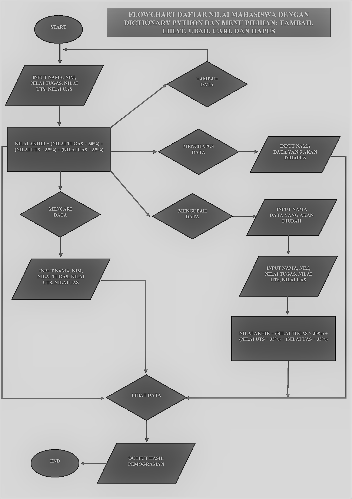

# praktik5
• Buat Dictionary daftar kontak

• Nama sebagai key, dan nomor sebagai value

• Tampilkan kontaknya Ari

• Tambah kontak baru dengan nama Riko, nomor 087654544

• Ubah kontak Dina dengan nomor baru 088999776

• Tampilkan semua Nama

• Tampilkan semua Nomor

• Tampilkan daftar Nama dan nomornya

• Hapus kontak Dina

Berikut Gambar dari program nya :

Berikut juga hasil outputnya.

program di atas menggunakan Dictionary

Tugas Praktikum

Buat program sederhana yang akan menampilkan daftar nilai
mahasiswa, dengan ketentuan

• Program dibuat dengan menggunakan Dictionary

• Tampilkan menu pilihan: (Tambah Data, Ubah Data, Hapus Data,
Tampilkan Data, Cari Data)

• Nilai Akhir diambil dari perhitungan 3 komponen nilai (tugas: 30%,
uts: 35%, uas: 35%)

• Buat flowchart dan penjelasan programnya pada README.md. • Commit dan push repository ke github

Berikut adalah program nya

    
    from prettytable import PrettyTable

    print("Nama : Muhamad Rifki")
    print("NIM : 312110205")
    print("Kelas : TI.21.A.1")
    print("=======================")
    print()

    daftar = []
    x = PrettyTable()

    while True:
        print("[ (L)ihat , (T)ambah, (U)bah, (H)apus, (C)ari, (K)eluar ]")
        tanya = input("Masukkan Pilihan : ")
        if tanya == "L":
            print("==== Daftar Nilai Mahasiswa ====")
            no = 0
            no += 1
            x.field_names = ["No", "NIM", " NAMA", "TUGAS", "UTS", "UAS", "AKHIR"]
            if not daftar:
                x.field_names = ["No", "NIM", " NAMA", "TUGAS", "UTS", "UAS", "AKHIR"]
                print(" D A T A  K O S O N G")
        else:
            for data in daftar:
                x.add_row([no, data["nim"], data["nama"], data["tugas"], data["uts"], data["uas"], data["akhir"]])
            print(x)
    elif tanya == "T":
        print("Tambah Data ")
        nim_v = input("NIM : ")
        nama_v = input("Nama Lengkap : ")
        uts_v = input("Nilai UTS : ")
        uas_v = input("Nilai UAS : ")
        tugas_v = input("Nilai Tugas : ")
        akhir_v = 0.3 * float(tugas_v) + 0.35 * float(uts_v) + 0.35 * float(uas_v)
        daftar.append({"nim": nim_v, "nama": nama_v, "tugas": tugas_v, "uts": uts_v, "uas": uas_v, "akhir": akhir_v})
        print()
        print("==== Daftar Nilai ====")
        i = 0
        for data in daftar:
            i += 1
            x.field_names = ["No", "NIM", " NAMA", "TUGAS", "UTS", "UAS", "AKHIR"]
            x.add_row([i, data["nim"], data["nama"], data["tugas"], data["uts"], data["uas"], data["akhir"]])
        print(x)
    elif tanya == "U":
        print("EDIT FILE")
        print("Data siapa yang akan diubah ?")
        siapa = input("Masukkan NIM Mahasiswa yang akan diubah : ")

        print("Data apa yang akan diubah ? : ")
        mhs = input(" 1. Nama \n 2. Nilai Tugas \n 3. Nilai UTS \n 4. Nilai UAS\n Pilih dengan angka (1/2/3/4) : ")
        if mhs == "1":
            ubahnama = input("Silahkan masukan nama yang benar : ")
            i = 0
            d = next(item for item in daftar if item['nim'] == siapa)
            d['nama'] = ubahnama
            x.field_names = ["No", "NIM", " NAMA", "TUGAS", "UTS", "UAS", "AKHIR"]
            i += 1
            x.add_row([i, d["nim"], d["nama"], d["tugas"], d["uts"], d["uas"], d["akhir"]])
            print(x)
        elif mhs == "2":
            ubahtugas = input("Masukkan Nilai Tugas yang benar : ")
            i = 0
            d = next(item for item in daftar if item['nim'] == siapa)
            d['tugas'] = ubahtugas
            lihatuts = d['uts']
            lihatuas = d['uas']
            lihatakhir = 0.3 * float(ubahtugas) + 0.35 * float(lihatuts) + 0.35 * float(lihatuas)
            d['akhir'] = lihatakhir
            x.field_names = ["No", "NIM", " NAMA", "TUGAS", "UTS", "UAS", "AKHIR"]
            for data in daftar:
                i += 1
                x.add_row([i, data["nim"], data["nama"], data["tugas"], data["uts"], data["uas"], data["akhir"]])
            print(x)
        elif mhs == "3":
            ubahuts = input("Masukkan Nilai UTS yang benar : ")
            i = 0
            d = next(item for item in daftar if item['nim'] == siapa)
            d['uts'] = ubahuts
            lihattugas = d['tugas']
            lihatuas = d['uas']
            lihatakhir = 0.3 * float(lihattugas) + 0.35 * float(ubahuts) + 0.35 * float(lihatuas)
            d['akhir'] = lihatakhir
            x.field_names = ["No", "NIM", " NAMA", "TUGAS", "UTS", "UAS", "AKHIR"]
            for data in daftar:
                i += 1
                x.add_row([i, data["nim"], data["nama"], data["tugas"], data["uts"], data["uas"], data["akhir"]])
            print(x)
        elif mhs == "4":
            ubahuas = input("Masukkan Nilai UAS yang benar : ")
            i = 0
            d = next(item for item in daftar if item['nim'] == siapa)
            d['uas'] = ubahuas
            lihattugas = d['tugas']
            lihatuts = d['uts']
            lihatakhir = 0.3 * float(lihattugas) + 0.35 * float(lihatuts) + 0.35 * float(ubahuas)
            d['akhir'] = lihatakhir
            x.field_names = ["No", "NIM", " NAMA", "TUGAS", "UTS", "UAS", "AKHIR"]
            for data in daftar:
                i += 1
                x.add_row([i, data["nim"], data["nama"], data["tugas"], data["uts"], data["uas"], data["akhir"]])
            print(x)
        else:
            print("PILIHAN SALAH")

    elif tanya == "C":
        print(" ========== PENCARIAN DATA ==========")
        print(" Pencarian berdasarkan NIM ")
        carinim = input("Masukkan NIM yang akan dicari : ")
        xdata = next(item for item in daftar if item['nim'] == carinim)
        print("NIM : ", carinim)
        print("Nama : ", xdata['nama'])
        print("Nilai Tugas : ", xdata['tugas'])
        print("Nilai UTS : ", xdata['uts'])
        print("Nilai UAS : ", xdata['uas'])
        print("Nilai Akhir : ", xdata['akhir'])
    elif tanya == "H":
        print("HAPUS DATA BERDASARKAN NIM")
        datahapus = input("Masukkan NIM data yang akan dihapus : ")
        xhapus = next(item for item in daftar if item['nim'] == datahapus)
        del xhapus['nim']
        del xhapus['nama']
        del xhapus['tugas']
        del xhapus['uts']
        del xhapus['uas']
        del xhapus['akhir']
        print("Data Berhasil Dihapus")
        no = 0
        no += 1
        x.field_names = ["No", "NIM", " NAMA", "TUGAS", "UTS", "UAS", "AKHIR"]
        if not daftar:
            x.field_names = ["No", "NIM", " NAMA", "TUGAS", "UTS", "UAS", "AKHIR"]
            print(" D A T A  K O S O N G")
        else:
            for data in daftar:
                x.add_row([no, data["nim"], data["nama"], data["tugas"], data["uts"], data["uas"], data["akhir"]])
            print(x)

    elif tanya == "K":
        print("ANDA KELUAR DARI APLIKASI")
        break
    else:
        print("ANDA MEMILIH PILIHAN YANG SALAH")
Dan berikut adalah untuk output programnya

Masih sama menggunakan ditionary saya menambahkan menu untuk lihat data,menambah data,ubah data,hapus data,cari data dan keluar

-code syntax di bawah merupakan kode untuk menambahkan data yang ingin kita masukan

    
    elif tanya == "T":
        print("Tambah Data ")
        nim_v = input("NIM : ")
        nama_v = input("Nama Lengkap : ")
        uts_v = input("Nilai UTS : ")
        uas_v = input("Nilai UAS : ")
        tugas_v = input("Nilai Tugas : ")
        akhir_v = 0.3 * float(tugas_v) + 0.35 * float(uts_v) + 0.35 * float(uas_v)
        daftar.append({"nim": nim_v, "nama": nama_v, "tugas": tugas_v, "uts": uts_v, "uas": uas_v, "akhir": akhir_v})
        print()
        print("==== Daftar Nilai ====")
        i = 0
        for data in daftar:
            i += 1
            x.field_names = ["No", "NIM", " NAMA", "TUGAS", "UTS", "UAS", "AKHIR"]
            x.add_row([i, data["nim"], data["nama"], data["tugas"], data["uts"], data["uas"], data["akhir"]])
        print(x)
Dan bisa di liat di program di atas ada beberapa syntax yang di maksud kan untuk menu berikut

    while True:
        print("[ (L)ihat , (T)ambah, (U)bah, (H)apus, (C)ari, (K)eluar ]")
Dan berikut adalah untuk flowchart dari program di atas

Begitu Saja penjelasan dari saya kurang lebih nya mohon maaf terimakasih.

